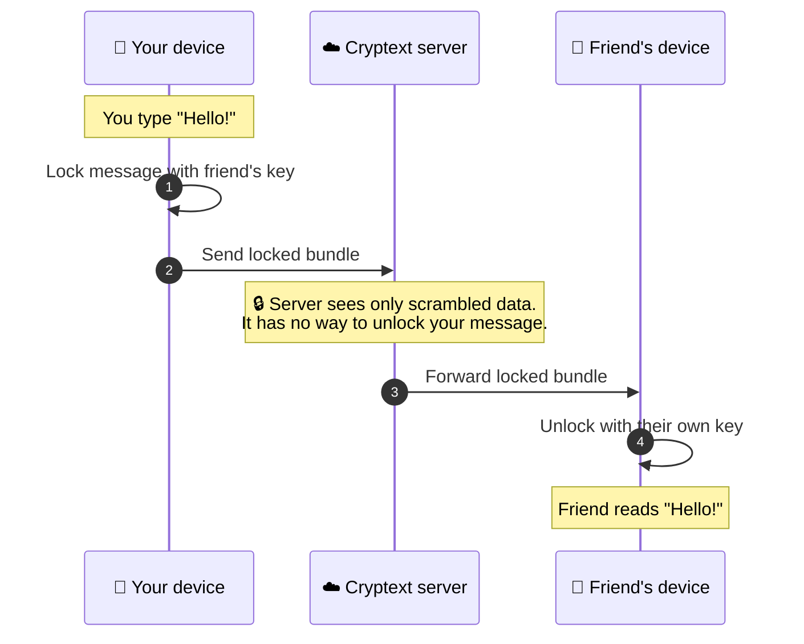
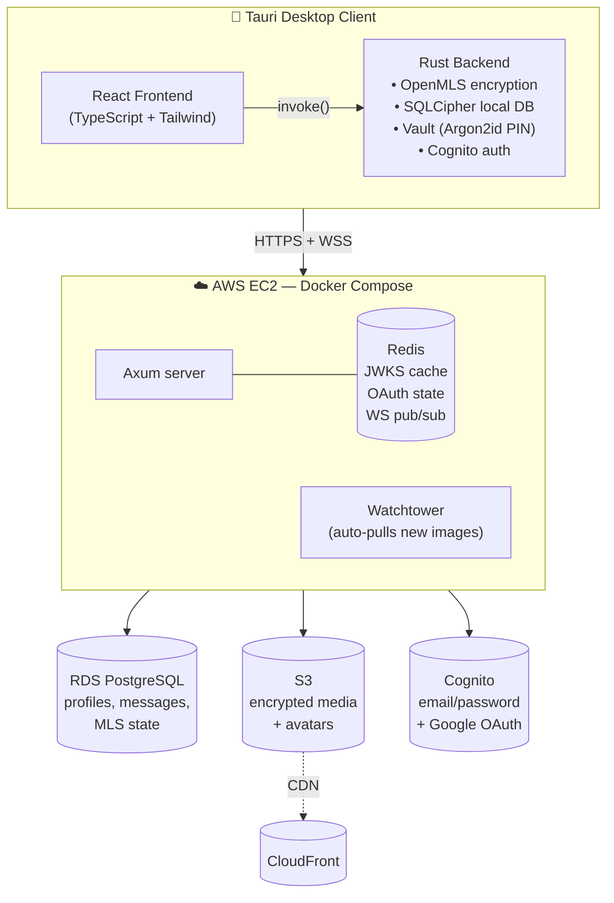

# Cryptext

A secure, self-hostable desktop messenger. End-to-end encrypted with [MLS (RFC 9420)](https://datatracker.ietf.org/doc/rfc9420/), built on [Tauri v2](https://tauri.app/) for the client and [Axum](https://github.com/tokio-rs/axum) for the server. The server stores and relays ciphertext only — decryption happens on user devices.

**Status:** pre-1.0, actively developed. Desktop client (Windows/macOS/Linux) ships via signed installers and auto-updates. Native Android is the next planned platform.

## How Cryptext keeps your messages private

Every message you send is locked on your device *before* it leaves your computer. The server that delivers the message to your friend never holds the key and cannot read what you wrote — only you and the person you're talking to can:



A few things this means in plain terms:

- **Your messages live on your devices, not on a server.** The server only stores the locked, unreadable version.
- **If the server is ever hacked or subpoenaed, attackers get scrambled data** — not your conversations.
- **The keys that unlock your messages never leave your device.** They're protected by a PIN only you know; we never see that PIN either.
- **Every new message uses a fresh key.** Even if one key were somehow exposed, older and newer messages stay safe.

The underlying cryptography is [MLS (RFC 9420)](https://datatracker.ietf.org/doc/rfc9420/), the same modern standard being adopted by major secure messengers. See the [architecture section](#architecture) below for the technical view.

## Features

### Messaging
- **End-to-end encrypted direct messages** via OpenMLS. X25519 key exchange, AES-128-GCM symmetric encryption, SHA-256 hashing, Ed25519 signatures.
- **Forward secrecy and post-compromise security** — group keys ratchet forward on every message; compromise of a device does not leak past or future messages beyond the sliding out-of-order window.
- **KeyPackages auto-replenished** — 50 uploaded per device, topped up when the server reports fewer than 10 remaining. Stale packages cleaned up when a signer regenerates.
- **Welcome-inline-with-first-message** — conversation creation sends the MLS Welcome alongside the first application message to avoid an extra round trip.
- **Messages blocked, never fallback-sent plaintext** if the recipient has no key packages.
- **Encrypted media sharing** — images (JPEG/PNG/WebP/GIF) and videos (MP4/WebM). Client-side AES-256-GCM over the file, uploaded to S3 as a ciphertext blob; the decryption key travels inside an MLS-encrypted message. Drag-and-drop in chat, image thumbnails, click-to-expand, video download-and-play.
- **Local media cache** so previously-viewed media doesn't re-download.
- **Real-time delivery** — WebSocket notifies connected clients of new messages without polling; server-side the WebSocket is hosted by Axum with a Redis pub/sub connection registry.
- **Incremental message fetch** — WebSocket notifications trigger a targeted "messages since timestamp" fetch rather than a full history reload.

### Local storage
- **Per-user SQLCipher database** — decrypted plaintext lives only on the user's device in `messages_{user_id}.db`.
- **MLS state persisted as JSON** via OpenMLS's serializable `MemoryStorage` provider (`mls_{user_id}.json`).
- **Vault with PIN-derived key hierarchy** — Argon2id PIN → KEK → wraps a random DEK → DEK encrypts the local DB. The PIN never leaves the device. Vault unlocks at login; a vault file stores the salt, encrypted DEK, and nonce.

### Identity & auth
- **AWS Cognito** — email/password and Google OAuth (confidential client with HMAC-SHA256 SECRET_HASH).
- **Session store** on the client (in-memory mutex-wrapped) holds JWTs. Refresh happens automatically with a 60-second buffer against clock skew.
- **JWKS cache on the server** — Redis-backed, 24-hour TTL. OAuth state is also Redis-backed with a 5-minute TTL.

### Profiles & friends
- **Profile**: username (unique), display name, avatar (CloudFront-served, 5MB limit), online status (online / idle / DND / offline).
- **Avatar uploads validated** — whitelist on MIME type and magic-byte verification. Only `https://` avatar URLs rendered client-side.
- **Friend requests**: send by username, accept/decline, cancel outgoing. Incoming and outgoing pending requests visible with avatars and status.
- **Friends list** with online-only filter, search, message shortcut, remove with confirmation, copy username.

### UI
- **React + Tailwind v4 + shadcn/ui** (Radix under the hood).
- **Two-panel home layout**: Recent Messages sidebar on the left (with pinned profile card at the bottom), right pane swaps between the friends list and the active DM conversation.
- **Conversation intro card** above messages (partner identity + "beginning of history" line). Messages bottom-anchored — sparse chats stack from the bottom and grow upward.
- **Greyscale theme** across light and dark modes; system-theme–aware, with a `.dark` class toggled on `<html>` so Tailwind dark variants reach portalled content (dialogs, dropdowns).
- **Profile editing is a popup dialog**; initial profile setup after signup is a full-page flow.

### Security posture
- **Per-IP rate limiting** (60 req/s burst 30) and **per-user key-package cap** (max 500, 5KB per package).
- **Authenticated endpoints** enforce membership — e.g. `claim_key_package` requires auth, `store_welcome` requires group membership with a 32KB payload cap, `register_group` validates members are conversation participants.
- **Array-length caps** on every endpoint that accepts a list (`member_ids`, `user_ids`, messages paginated at 500 max).
- **UUID validation** on all friend and MLS path parameters.
- **Error redaction** — `AppError::Internal` messages are replaced with generic text before returning to the client; full details logged server-side. OAuth errors are sanitized the same way.
- **Content Security Policy** enforced in Tauri configuration.
- **No plaintext leaks in logs** — `eprintln!` replaced with `tracing::debug`, debug `println!` removed.

### Distribution
- **Windows signed installer** via NSIS + osslsigncode on a self-hosted runner. Auto-updater uses Tauri's Ed25519 signature verification against `latest.json` on GitHub Releases.
- **Releases triggered manually** via GitHub Actions `workflow_dispatch`; version bumped from the latest git tag automatically.

## Architecture

### High-level



### Desktop client (`apps/desktop/`)

- **React frontend** (`src/`) — Vite + TypeScript + Tailwind v4 + shadcn/ui. Routes guarded by session + profile-complete status. No global state store; hooks and page-local state communicate with the Rust backend via Tauri `invoke()`.
- **Rust backend** (`src-tauri/src/`) — Tauri v2 with plugins `deep-link` (OAuth callback), `single-instance`, `updater` (GitHub Releases). Modules:
  - `auth.rs` — Cognito sign-in/up/out, OAuth, `SessionStore`.
  - `conversations.rs` — DM + message commands. Orchestrates MLS encrypt → send → local store.
  - `friends.rs` — friend requests and friend list.
  - `profile.rs` — profile CRUD, avatar upload, status updates.
  - `mls.rs` — OpenMLS engine: groups, KeyPackages, encrypt/decrypt, Welcome processing, state persistence.
  - `local_db.rs` — SQLCipher-encrypted SQLite for decrypted message plaintext per user.
  - `vault.rs` — DEK/KEK hierarchy, Argon2id PIN derivation, `.vault` file management.
  - `http_client.rs` — shared reqwest client (30s request / 10s connect timeouts, bearer token).
  - `config.rs` — server URL config; defaults to `https://cryptext.duckdns.org`, override with `SERVER_URL` env var.
  - `updates.rs` — auto-update via `tauri-plugin-updater`.

### Server (`apps/server/`)

- **Axum** on Tokio with `sqlx` (max 10 connections, 5s acquire timeout).
- JWT middleware validates Cognito tokens; JWKS cached in Redis (24h TTL).
- **Routes**:
  - `cognito.rs` — sign-in/up/confirm/refresh.
  - `google_oauth.rs` — start / callback / status polling.
  - `profile.rs` — profile CRUD, avatar upload, status.
  - `friends.rs` — friends, friend requests (accept/decline/cancel/remove).
  - `conversations.rs` — DMs, messages (incremental fetch via `?after=` query), mark-read.
  - `media.rs` — upload/download encrypted blobs (up to 100MB per file).
  - `mls.rs` — key-packages, groups, welcome, commit, welcome-ack.
  - `health.rs` — health check.
  - `ws/` — WebSocket module with auth-first-message handshake, connection registry, Redis pub/sub for cross-instance delivery.

### AWS infrastructure

| Service | Role |
|---|---|
| **EC2** (t3.small, Ubuntu) | Runs Docker Compose: Axum container + Redis + Watchtower (auto-pulls new images from GHCR). |
| **Cognito** | User pool with email/password + Google OAuth. RS256 JWTs, confidential client. |
| **RDS** (PostgreSQL) | `profiles`, `conversations`, `conversation_participants`, `messages`, `friends`, `friend_requests`, `mls_groups`, `mls_group_members`, `mls_welcome_messages`, `mls_pending_messages`, `key_packages`. |
| **S3** | Avatars (`avatars/{user_id}/{filename}`, 5MB cap) and encrypted media (`media/{conversation_id}/{uuid}.enc`, 100MB cap). |
| **CloudFront** | CDN in front of S3 avatar bucket. |
| **Secrets Manager** | `cryptext/server-config` — database URL, Cognito credentials, S3 bucket, CloudFront URL, WebSocket URL. |
| **Redis** (container on EC2) | JWKS cache (24h), OAuth state (5m), WebSocket connection registry / pub-sub. |

### Repository layout

```
.
├── apps/
│   ├── desktop/           Tauri desktop app (React + Rust)
│   │   ├── src/           React frontend
│   │   ├── src-tauri/     Rust backend
│   │   └── package.json
│   └── server/            Axum server (Rust)
│       ├── src/
│       └── Cargo.toml
├── .github/workflows/     release, server deploy, status checks
├── CLAUDE.md              working notes for AI-assisted development
├── CHANGELOG.md
└── README.md              (this file)
```

## Development

### Prerequisites
- Node.js + [pnpm](https://pnpm.io/)
- Rust (stable)
- For desktop builds: Tauri v2 prerequisites for your OS ([docs](https://v2.tauri.app/start/prerequisites/))

### Desktop client
```bash
cd apps/desktop
pnpm install
pnpm tauri dev              # Vite dev server + Tauri native window
pnpm tauri build            # production installer
pnpm dev                    # frontend only (port 1420)
pnpm build                  # TypeScript check + Vite build
```

### Server
```bash
cd apps/server
cargo build                 # debug
cargo run                   # runs against configured DB/Redis
cargo check                 # type-check without building
```

### Environment
Desktop client loads `.env` from the project root via `dotenvy`:
- `SERVER_URL` — override default `https://cryptext.duckdns.org`.
- `WEBSOCKET_URL` — override; otherwise fetched from the server at runtime.

Server expects `cryptext/server-config` in AWS Secrets Manager or equivalent environment variables (`DATABASE_URL`, `REDIS_URL`, `S3_BUCKET`, `COGNITO_*`, `CLOUDFRONT_URL`, `WEBSOCKET_URL`).

### Release
Desktop releases are triggered manually from the `release.yml` workflow (GitHub Actions, self-hosted runner). Version bumped from the latest git tag. Build code-signed (Windows Authenticode via osslsigncode), published to GitHub Releases with `latest.json` for the auto-updater.

Server deploys automatically on push to `main` touching `apps/server/**` via `deploy-server.yml` — GitHub Actions builds the Docker image, pushes to GHCR, Watchtower on EC2 picks up the new `:latest` tag.

## Roadmap

- **Group chats** — schema and MLS plumbing already support N-member groups; UI and group-creation endpoint pending.
- **Native Android client** — Kotlin + Jetpack Compose UI, Rust crypto core extracted to `crates/cryptext-core/` and compiled for Android via `cargo-ndk` + `uniffi` bindings. See the platform notes vault (`Development Progress/Additional Platform Development.md`) for the detailed plan.
- **Multi-device support** — each device as its own MLS leaf with server-mediated encrypted state sync. Designed, not yet implemented.
- **iOS client** — reuses the same `cryptext-core` crate via `uniffi`'s Swift bindings. Post-Android.

## License

This project is currently source-available. License details to be determined.
